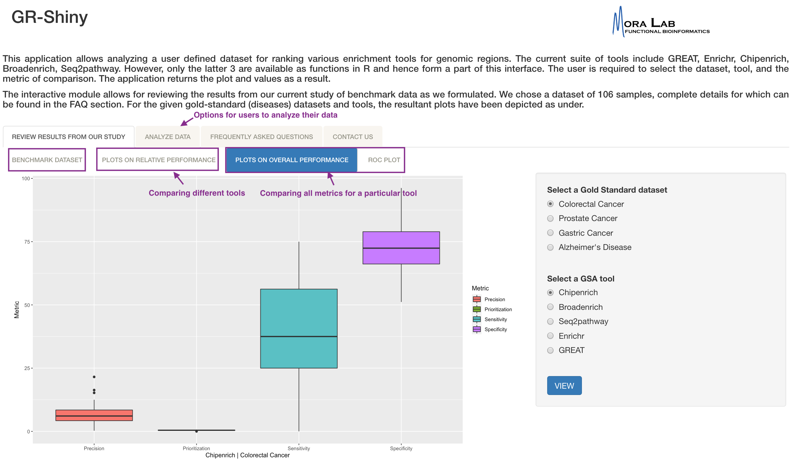

---
output:
  pdf_document: default
  html_document: default
---
# gr-shiny
(A genomic-range gene-set-analysis method benchmarking shiny app)

 Gene Set Analysis (GSA) "has been applied to the functional interpretation of enrichment on DNA/chromatin binding or modifications, that is, ChIPSeq, ChIP-exo, ChIP-chip, DamID, ChIP-PET and similar datasets (collectively called ChIP-x methods by some authors), but especially to ChIP-seq data, which provides information of transcription factor binding data, histone mark data or histone variant data. In essence, such "genomic GSA tools" associate binding or modification on a genomic region to an annotated coding gene (mapping) and then perform GSA for that gene" (https://doi.org/10.1093/bib/bbz090). 

 "gr-shiny" is a shiny app that allows the user to perform a benchmark comparison between the existing genomic-range GSA tools, using either our selected gold standard datasets or the user's definition of a gold standard. 

 

 

For more information on Gene Set Analysis methods applied to genomic range data, see: https://doi.org/10.1093/bib/bbz090
