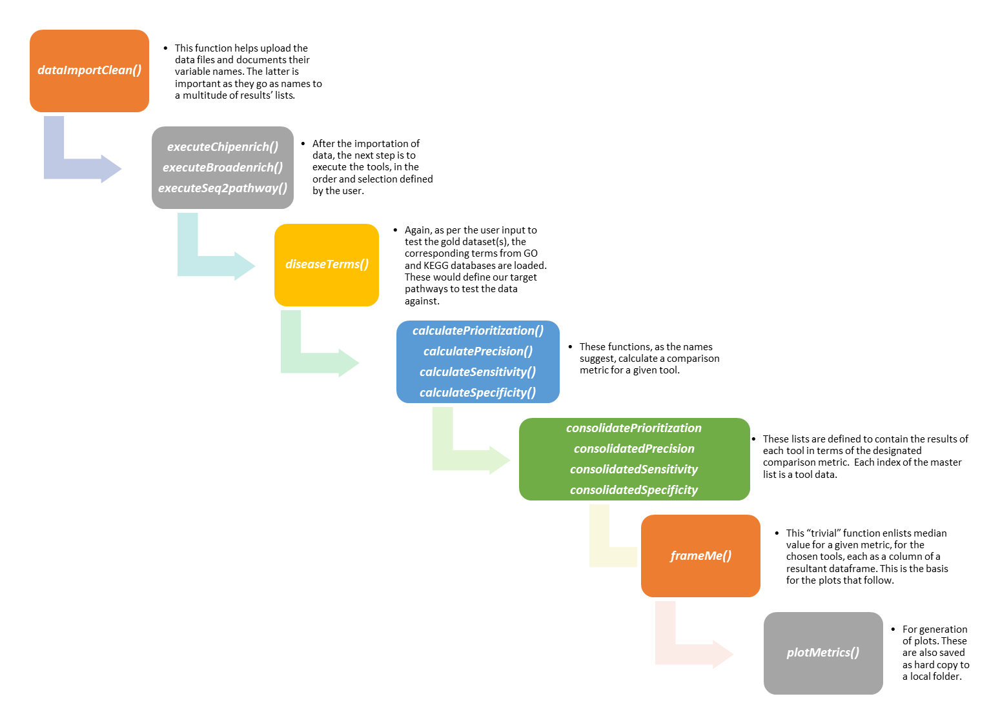
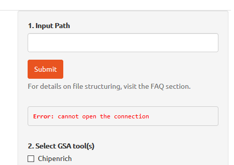
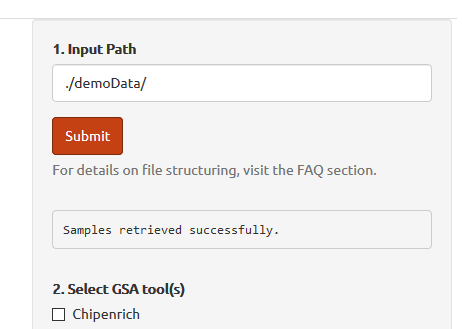
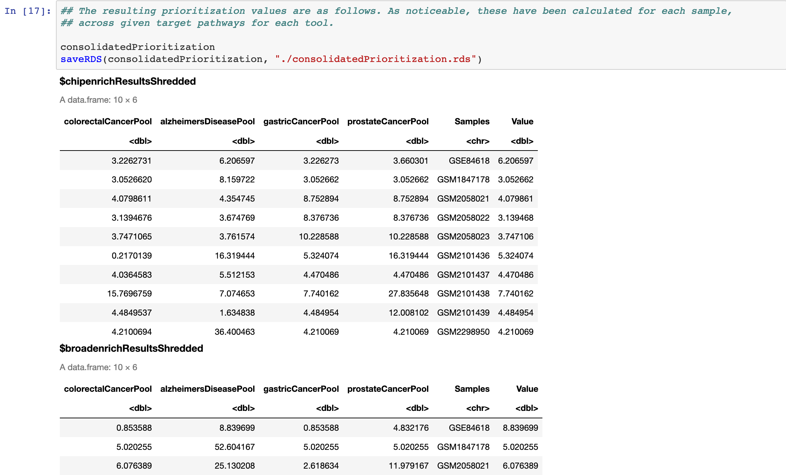
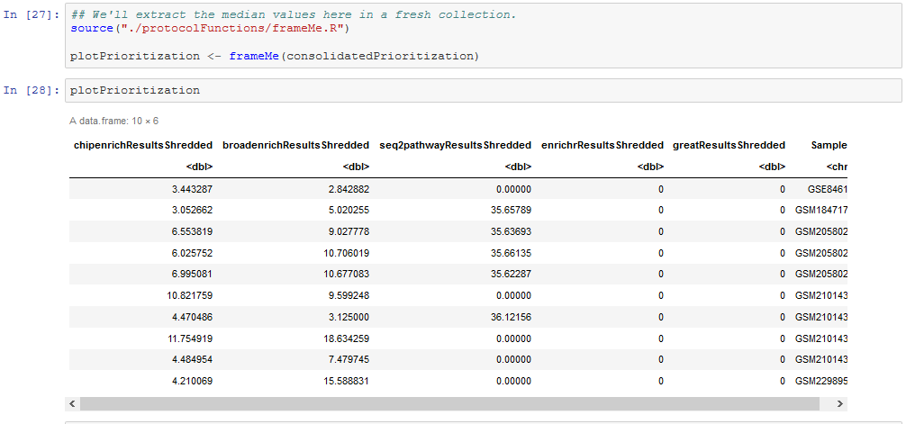
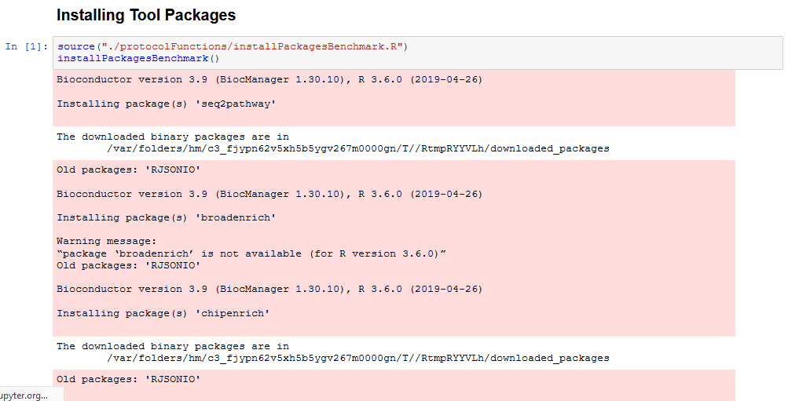
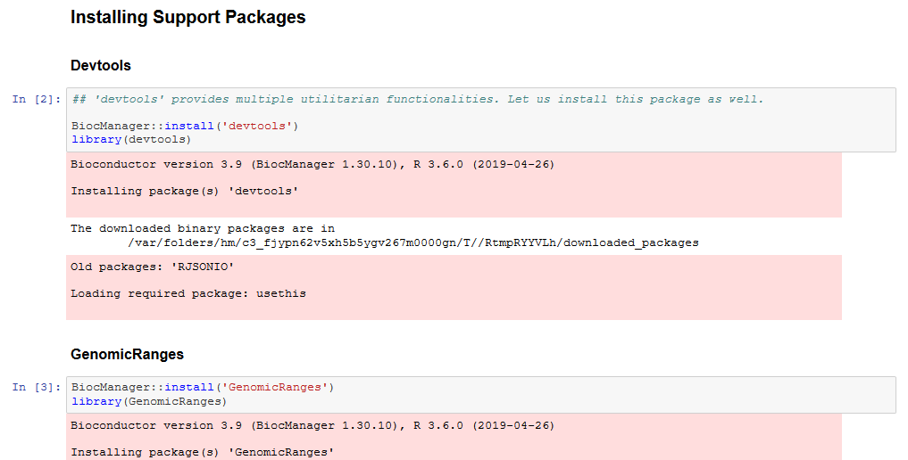
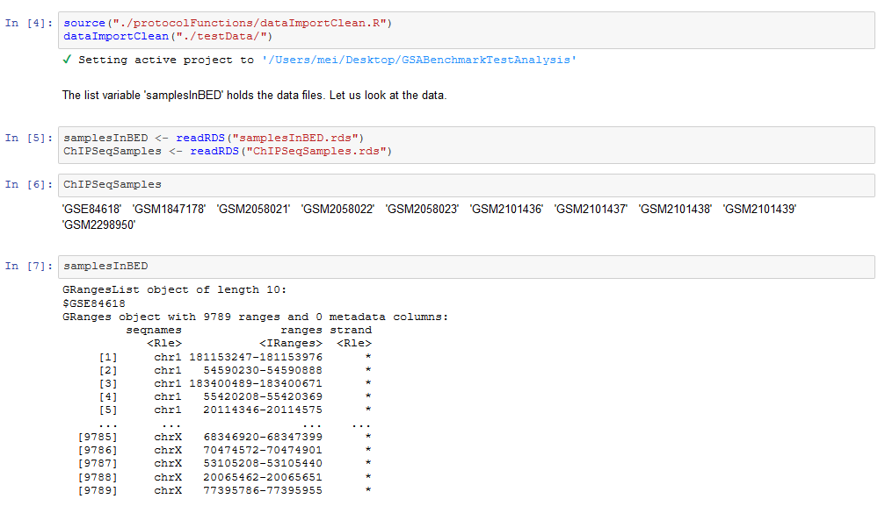
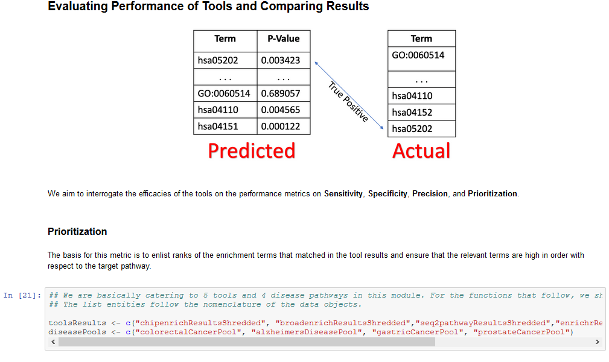

 
<ol>
<li> **What is GR-shiny?** </li>

 GR-Shiny is a shiny app that allows users to benchmark various genomic-regions enrichment tools against their data. This comparison can be parametrized via metrics as sensitivity, specificity, precision, and prioritization. The following graphic represents the overall workflow and the functions in use. 
 

 

 
 

<li> **How is GR-shiny built?** </li>

 As a reference, kindly follow this [workflow](https://nbviewer.jupyter.org/github/mora-lab/benchmarks/blob/master/genomic_range/workflows/Overall_Workflow.ipynb), or visit *genomic_range* in the [repository](https://github.com/mora-lab/benchmarks) for function definitions. P.S. the function definitions for the notebook have been tweaked a little to adapt to the Shiny App. 

 
 

<li> **What is the scope of the current set of methods available in this application?** </li>

 Due to their availability as functions in R, this application is limited to three tools currently for the end user, viz. [ChIPEnrich](http://chip-enrich.med.umich.edu/), [BroadEnrich](http://broad-enrich.med.umich.edu/), and [Seq2Pathway](https://www.bioconductor.org/packages/release/bioc/html/seq2pathway.html). However, in our analysis we have also compiled results explicitly from [GREAT](http://bejerano.stanford.edu/great/public/html/) and [Enrichr](http://amp.pharm.mssm.edu/Enrichr/) as well, as the two are prominent methods in use. These provide for contemporary options for testing enrichment in genomic regions. In the future, there is a distinct poosibility of including novel tools as part of an extended anslysis.

 
 

<li> **Are the gold standard datasets extendible?** </li>

 Yes. Although, in it's current implementation, the gold standard datasets available for processing are *Colorectal Cancer*, *Gastric Cancer*, *Prostate Cancer*, and *Alzheimer's Disease*. However, other GO and KEGG definitions for the gold datasets could be manually compiled and treated as in <i>diseaseTerms.R</i>. Please follow the definitions for functions in the said repository. The [benchmark dataset](https://nbviewer.jupyter.org/github/mora-lab/gr-shiny/blob/master/www/GSA_ChIP_Seq_Master_Table.pdf) for our pilot study on 106 samples has a case-distribution affiliated with any of the aforementioned diseases.    

 
 

<li> **What is the primary input for this pipeline?** </li>

 This application takes over from the path for the folder that holds the BED files for the genomic regions defining a sample. There could be multiple samples, although, the following conditions must hold. First, the BED files must be without a header. Second, the data must be in the basic tab-separated, BED format with *Chromosome*, *Start*, and *End* values; and third, the files must be saved with the **GEO sample name** as the primary name (preferably) and **.bed** extension. In addition, a metadata table is also warranted that holds the information similar to the one as illustrated in the **BENCHMARK DATA** tab. The crucial thing to note is that the column names **GSM** and **Disease...Target..Pathway** should be staple with the information on sample names and the target pathways/ diseases they represent. The file is expected to be a tab-delimited, text file (extension *.txt*) in the same folder location as the other BED files. P.S. We are only handling Colorectal Cancer, Prostate Cancer, Gastric Cancer, and Alzheimer's Disease in the current version, and so the samples must be in accordance.   
 
Initially when the app executes, the message box under 'Analyze Data' sidebar panel displays an error message attributing to no input from the user, as pictured below.
 

 
This is ephimeral. After the path entered by the user is recognized as valid, the samples are loaded and the error message washes off.
 

 
 

<li> **How to track processing of the Shiny app?** </li>

 The featured *animated icons* represent the background working of the application. Exceptionally, they also signify that a wait is active for the user's input.

 
 

<li> **How can the results be downloaded?** </li>

 The results are saved as RDS objects inside the *./data/results/* folder of the working directory. The resultant plots (with apt nomenclature) are also saved as PNG graphics at the same location.

 
 

<li> **What if I have a method and I want to test it with the listed protocol?** </li>

 There could be two possible approaches to accomplish this.
  <ol>
    <li> **Add as a staple method (permanently)** </li>
       
      (i) <i><b>The R package for the tool/list of associated packages that need to be loaded.</b></i> These definitions go the the <i>global.R</i> file that installs the required packages and loads their respective libraries. 
      (ii) <i><b>The column names/ indices that are indicative of the enrichment terms and p-value.</b></i> Since we aim to examine the commonalities in the enrichment(GO and KEGG) terms from the tool output and the documented gold datasets(diseases here), acknowledging statistical significance to gauge sensitivity, specificity, precision, and prioritization metrics, we would like to extract these data from the rest of the results. Despite though, we save both the results separately. This workflow is defined in the tool execution functions(<i> executeChipenrich() </i>, say.). The function body for the new methods can be aggregately replicated from the ones already existing. Also, in the <i>ui.R</i>, the name of the function has to be listed as a part of the options available to the user and the definition added to the input control widget (<i>checkBoxInput</i>).Later, on calculating the comarison metrics, a "consolidated" list is engendered that has results for all metrics, for each tool, for each sample listed in the marked directory. See below, for reference. 
       
      Further, the median values for all these results for each tool, for each sample are sourced for plotting the comparison metrics.  
       
    <li> **Test a new method locally** </li>
    

     
      (i) <i><b>Download our jupyter notebook.</b></i> The [repository](https://github.com/mora-lab/benchmarks/)   is a complete reckoner in itself. The subfolder **genomic_range/workflows** contains some out-of-scope modules too (in context to the Shiny App), like inclusion of simulation study results and <b>GREAT</b> and <b>Enrichr</b> that are not available as R packages and their results have been manually compiled and plugged into the pipeline.
      (ii) <i><b>The list of packages that need to be loaded.</b></i>Note that the Shiny App is derived out the jupyter notebook and not vice-versa, and thus there is minor morphism in the functions that drive the jupyter notebook and the Shiny App. For example, the installation of packages, loading of libraries, and defining global variables has been carried out in <i> global.R </i> file for the Shiny App. Contrarily, the <i>installPackagesbenchmark()</i> function in the <i>protocolFunctions</i> folder is responsible for setting up the work environment. 
       
      If there are certain extraneous packages that are to be used, they could be defined next.
       
      The next function is for importing sample data and sample names. We define <i>ChipSeqSamples</i> as a list of sample names, which are in accordance to the GEO identifier. The treatment for this variable is different in the Shiny App (global variable). The scope is such to be sourced to all downstream functions. 
       
      When we have the data, we execute the tools. At this point, we can include the execution of the novel tool. The argument for such a function is the folder location that holds the data. 
      Likewise, the functions that execute a particular tool in Shiny App contain script for execution as well as extracting the relevant columns(enrichment terms and p-values). This functionality is available in segregation in the jupyter notebook: function execution is explicit to extracting information(<i>extractingValuedResults()</i> does that). 
      Also, we add two master lists, viz. <i>toolsResults</i> and <i>diseasePools</i> here, that hold the names of results and gold datasets. This step is automatic in the Shiny App version.
       
    

  </ol>
  

 
</ol>